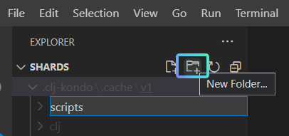
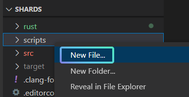

# Run Shards

!!! note
    This guide is for new users unfamiliar with Visual Studio Code and the creation of new code files. 
    
    Click [here](#overview) to skip the tutorial and jump to the overview.

Learn how to employ Shards to execute code and bring your works to fruition!

Ensure that you have [Shards built](./building-shards.md) before attempting to run it.

## Preparing the Script ##

In VS Code, select “File → Open Folder…” (Ctrl+K+O) and select the Shards repository.

Select the New Folder button  near the top of your Explorer window and name the folder “scripts”.



Right-click the “scripts” folder and select “New File…”. Name the file “helloworld.edn”.



??? ".edn"
	EDN is a file format used by other programming languages such as Clojure.

Paste the following code into your new file and save it.
```
(defmesh main)
(defwire helloworld
  (Msg "Hello World"))
(schedule main helloworld)
(run main)
```
??? "What does the code mean?"
    Even without in-depth knowledge, the Shards language is visual enough for you to make a guess at what it does. You define a mesh called “main” and create a wire called “helloworld” that sends out a “Hello World” message. We then schedule the wire on the mesh and run it. The code is therefore about sending out a “Hello World” message.

    To better understand the intricacies of the code used, do give the [Shards primer](../../learn/shards/index.md) a read!

Now that we have created a .edn file, the final step is to use shards.exe to execute the code in it.

## Running the Script ##

Open the MinGW terminal and navigate to your Shards repository with the command `cd $(cygpath -u '(X)')`, where (X) is the directory of your folder. For example, `cd $(cygpath -u 'C:\Fragcolor\Shards')`. 

```
cd $(cygpath -u '(X)')
```
 
To run the Debug version of Shards, use the command `./build/Debug/shards ./scripts/(X).edn`, whereby (X) is the name of your .edn file.

```
./build/Debug/shards ./scripts/(X).edn
```

To run the Release version of Shards, use the command `./build/Release/shards ./scripts/(X).edn`, whereby (X) is the name of your .edn file.

```
./build/Release/shards ./scripts/(X).edn
```

To run our “helloworld.edn” script, we run the command `./build/Debug/shards ./scripts/helloworld.edn`.

=== "Command"

    ```
    ./build/Debug/shards ./scripts/helloworld.edn
    ```

=== "Output"

    ```
    [debug] [2022-09-19 11:47:36.873] [T-19628] [SHCore.cpp::163] Exe path: C:\Fragcolor\Shards\build\Debug
    [debug] [2022-09-19 11:47:36.873] [T-19628] [SHCore.cpp::164] Script path: C:\Fragcolor\Shards\scripts
    .
    .
    .
    [info] [2022-09-19 11:47:36.893] [T-19628] [logging.cpp::98] [helloworld] Hello World
    [debug] [2022-09-19 11:47:36.893] [T-19628] [runtime.cpp::2712] Running cleanup on wire: helloworld users count: 0
    [debug] [2022-09-19 11:47:36.893] [T-19628] [runtime.cpp::2752] Ran cleanup on wire: helloworld
    [trace] [2022-09-19 11:47:36.893] [T-19628] [runtime.cpp::2031] wire helloworld ended
    [trace] [2022-09-19 11:47:36.893] [T-19628] [runtime.hpp::294] stopping wire: helloworld

    ```

Congratulations! You have printed out your first “Hello World” message to the terminal with Shards! ⭐

##  Overview ##

1. Use `./build/Debug/shards ./scripts/fileName.edn` to run scripts with the Debug version of Shards.
```
./build/Debug/shards ./scripts/fileName.edn
```

2. Use `./build/Release/shards ./scripts/fileName.edn` to run scripts with the Release version of Shards.
```
./build/Release/shards ./scripts/fileName.edn
```

--8<-- "includes/license.md"
