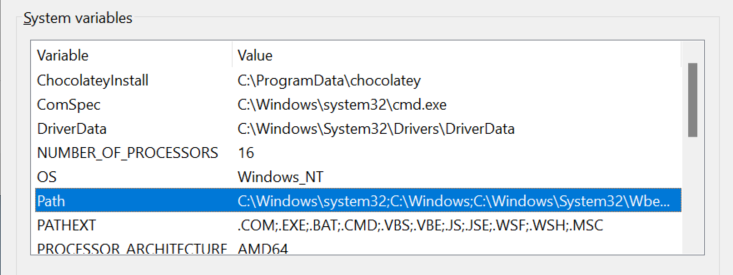
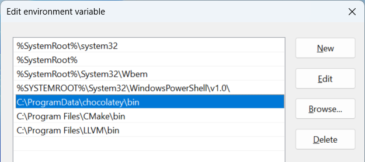

<!-- TODO: Complete guides for Mac and Linux. -->

# Getting Started

!!! note
    This guide is for new users unfamiliar with the installation process. 

    Click [here](#overview) to skip the tutorial and jump to the overview.

Learn how to set up the development environment to start working with our projects!


## Setting up the C/C++ Compiler

A compiler translates human-readable code into machine code. We will be setting up the C/C++ compiler so that our code written in the human-readable C++ language can be understood by the computers!

=== "Windows"

    First, [download Chocolatey](https://docs.chocolatey.org/en-us/choco/setup#installing-chocolatey) and install it using an [administrative shell](https://www.howtogeek.com/194041/how-to-open-the-command-prompt-as-administrator-in-windows-8.1/). Chocolatey is a package manager that simplifies the installation of the tools we will need.

    We will now install the compiler and other build tools using Chocolatey.
    Open up the Command Prompt and enter the following commands:

    ??? tip
        You can use the Windows Search Bar to find the Command Prompt application.
        

    ```cmd
    choco install -y cmake --installargs '"ADD_CMAKE_TO_PATH=System"'
    choco install -y ninja
    choco install -y llvm
    refreshenv
    ```

    !!! note
        By default, `System` will make `cmake` available to all users on the Windows machine. To only set it for the current user, replace `System` with `User`.

    Next, we want to check that the tools were properly installed. Enter the following commands:

    === "CMD"
        ```cmd
        cmake --version
        ninja --version
        clang --version
        ```
    === "Output"
        ```
        cmake version 3.25.2
        1.11.1
        clang version 15.0.7
        ```
    
    If any of the above commands returned an error, it is possible that the `PATH` environment variable is not properly set.
    Search for “Edit the system environment variables” in the Window’s search bar and select the option that appears.

    !!! help
        You can also access the Environment Variables window from "Control Panel → System and Security → System → Advanced system settings".

    Double-click on “Path” under “System variables”.

    

    In the “Edit environment variable” window, check that paths to the installed tools are set as in the picture below.
        
    
    
    If not, click on “New” to add the missing values.

    !!! note
        `ninja` is installed under `C:\ProgramData\chocolatey\bin`

=== "Linux"

    Install `cmake`, `ninja`, `clang` and other development dependencies using the package manager of your favorite distribution.

    For example on Ubuntu, you can use the following commands:

    ```bash
    sudo apt install build-essential cmake ninja-build clang xorg-dev libdbus-1-dev libssl-dev mesa-utils
    ```


## Rust

Rust is another programming language that we will be using. Install it from [here](https://www.rust-lang.org/tools/install). 

=== "Windows"

    Open up the Command Prompt.

    ??? Tip
        You can use the Windows Search Bar to find the Command Prompt application.
        

    !!! help
        You can check if Rust is properly installed by using `cargo --version` in the Command Prompt. 

        If a version number is printed, your installation was successful!
            ```
            cargo --version
            ```

    We will be using the nightly version of Rust which is updated more frequently compared to the stable and beta versions. Install it with the following commands:
        ```cmd
        rustup toolchain install nightly
        rustup +nightly target add x86_64-pc-windows-msvc
        rustup default nightly-x86_64-pc-windows-msvc
        ```

=== "Linux"

    !!! help
        You can check if Rust is properly installed by using `cargo --version` in the Command Prompt. 

        If a version number is printed, your installation was successful!
            ```
            cargo --version
            ```

    We will be using the nightly version of Rust which is updated more frequently compared to the stable and beta versions. Install it with the following commands:
        ```bash
        rustup toolchain install nightly
        rustup +nightly target add x86_64-unknown-linux-gnu
        rustup default nightly-x86_64-unknown-linux-gnu
        ```

To add support for building to web browsers, input the following command:
    ```
    rustup +nightly target add wasm32-unknown-unknown
    ```

Use the `rustup update` command to update your installation. Since we are using the nightly release, you are encouraged to update often.
    ```
    rustup update
    ```


##  Git & GitHub

Git is a system used for managing and tracking changes in your code. It is also known as a Version Control System (VCS). It makes it easier for collaborators to work together, and allows you to access our projects too!

=== "Windows"
    Install Git [here](https://git-scm.com/download). The installation settings can be left unchanged.

    Alternatively, you can also use chocolatey:
    ```cmd
    choco install -y git
    ```

=== "Linux"
    ```bash
    sudo apt install git
    ```

Although Git is powerful, it can be daunting to use on its own. Instead, we use GitHub, a service which employs Git’s version control with its own to make project collaboration much easier. 

We recommend that you use a [Git GUI Client](https://git-scm.com/downloads/guis) to facilitate your work by pruning off the manual input of code and making the version control process more visual.

=== "Windows"

    We will be using [GitHub Desktop](https://desktop.github.com/) for the tutorials. You can install it with the default settings, and create a GitHub account when prompted if you do not have one.
    
    Alternatively, you can also use chocolatey:
    ```cmd
    choco install -y github-desktop
    ```

    !!! note
        Even though we recommend GitHub Desktop, feel free to use any GUI client of your choice!


## Code Editor

A code editor allows you to work with code more easily. We will be using Visual Studio Code (VS Code) for this tutorial.

=== "Windows"

    You can download it [here](https://code.visualstudio.com/download), and install it with the default settings.

    Alternatively, you can also use chocolatey:
    ```cmd
    choco install -y vscode
    ```

=== "Linux"

    The easiest is to install the snap package.
    ```bash
    sudo snap install --classic code
    ```

    Follow the [installation](https://code.visualstudio.com/docs/setup/linux#_installation) page for more details, and other installation alternatives.

!!! note
    You are free to use any code editor of your choice, although you will have to complete steps of this tutorial through alternate means.


### VS Code Extensions

Launch Visual Studio Code and open the Extensions view (Ctrl+Shift+X). We will be installing a few extensions to facilitate our VS Code experience.


Search for and install the following extensions:

1. C/C++

2. rust-analyzer

3. CodeLLDB 

4. Better TOML

5. Calva

6. CMake Tools

7. YAML


## Overview

=== "Windows"

    1. Install [Chocolatey](https://docs.chocolatey.org/en-us/choco/setup#installing-chocolatey)

    2. Install `cmake`, `ninja` and `llvm` using Chocolatey.
    ```cmd
    choco install -y cmake --installargs '"ADD_CMAKE_TO_PATH=System"'
    choco install -y ninja
    choco install -y llvm
    refreshenv
    ```

    3. Install [Rust](https://www.rust-lang.org/tools/install).

    4. Install and set up the Rust nightly build.
    ```cmd
    rustup toolchain install nightly
    rustup +nightly target add x86_64-pc-windows-msvc
    rustup default nightly-x86_64-pc-windows-msvc
    ```

    5. Install the Rust Web Assembly toolchain.
    ```cmd
    rustup +nightly target add wasm32-unknown-unknown
    ```

    6. Update Rust
    ```cmd
    rustup update
    ```

    7. Install [Git](https://git-scm.com/download).
    ```cmd
    choco install -y git
    ```

    8. Install [GitHub for Desktop](https://desktop.github.com/) or any other [Git GUI Client](https://git-scm.com/downloads/guis).
    ```cmd
    choco install -y github-desktop
    ```

    9. Install the [VS Code Editor](https://code.visualstudio.com/download).
    ```cmd
    choco install -y vscode
    ```

    10. Install [Extensions for Visual Studio Code](#vs-code-extensions).

=== "Linux"

    1. Install `cmake`, `ninja`, `clang` and other development dependencies
    ```bash
    sudo apt install build-essential cmake ninja-build clang xorg-dev libdbus-1-dev libssl-dev mesa-utils
    ```

    2. Install [Rust](https://www.rust-lang.org/tools/install).

    3. Install and set up the Rust nightly build.
    ```bash
    rustup toolchain install nightly
    rustup +nightly target add x86_64-unknown-linux-gnu
    rustup default nightly-x86_64-unknown-linux-gnu
    ```

    4. Install the Rust Web Assembly toolchain.
    ```bash
    rustup +nightly target add wasm32-unknown-unknown
    ```

    5. Update Rust
    ```bash
    rustup update
    ```

    6. Install [Git](https://git-scm.com/download).
    ```bash
    sudo apt install git
    ```

    7. Install the [VS Code Editor](https://code.visualstudio.com/download).
    ```bash
    sudo snap install --classic code
    ```

    8. Install [Extensions for Visual Studio Code](#vs-code-extensions).

--8<-- "includes/license.md"
