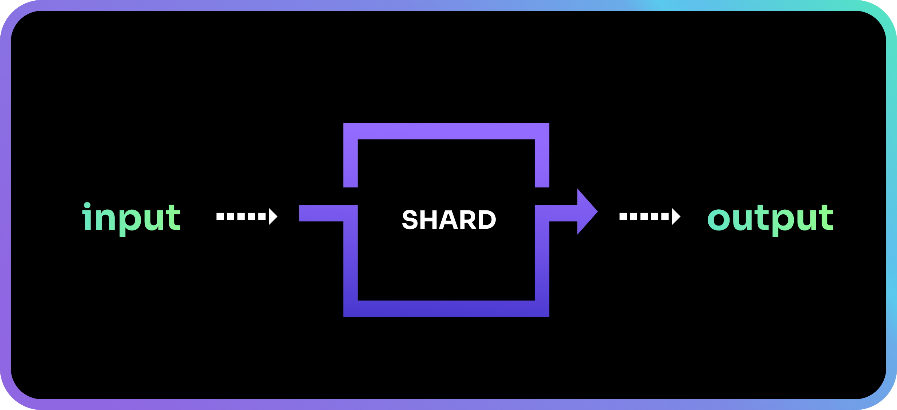
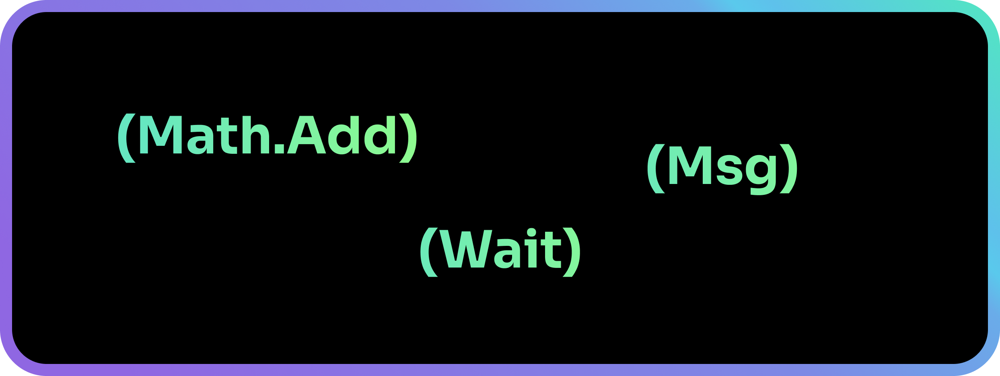
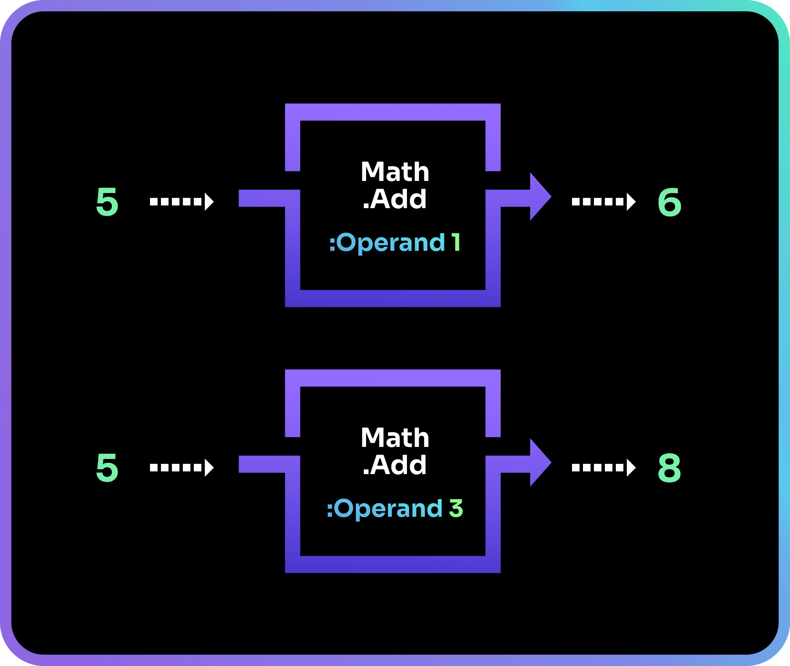

# Coding with Shards

In this chapter, we will be learning how to code with Shards so that you can write your very own program!

## Data Types

A shard can take in data, process it, and output the results.



There are many different types of data in the Shards language, and each shard will have specific data types that it can work with. 

For example, the [`Math.Add`](../../../reference/shards/Math/Add/) shard can only work with numeric data types, while the [`Log`](../../../reference/shards/General/Log/) shard that prints information to the console can work with `Any` data type.

Here are some of the data types found in Shards:

| Data Type   | Description                                            | Example           |
| :---------- | :----------------------------------------------------- | :---------------- |
| `Any`       | Any data type.                                         |                   |
| `None`      | No data type.                                          |                   |
| `Bool`      | Evaluates to either `true` or `false`.                 | `true`, `false`   |
| `Float`     | A numerical value with a decimal point.                | `2.53`, `-9.124`  |
| `Int`       | A numerical value with no decimals. Read as "integer". | `2`, `-9`         |
| `Sequence`  | A collection of values.                                | `[2.5, -9.1, 9.7]`|
| `String`    | Characters enclosed by double quotes.                  | "A string!"       |
| `Wire`      | A sequence of shards.                                  |                   |

!!! note
    A shard can have multiple data types as its input and output. For example, the shard `Math.Add` can have its input and output as an `Int`, or it can have its input and output as a `Float`.

For the full list of data types and more in-depth reading, check out the `Types` documentation page [here](../../../reference/shards/types/).

## Variables

To better work with data across your code, we can assign them to data containers known as *variables*. Imagine a scenario where you have a float `3.141592653589793` that you need to reuse in code multiple times. Instead of typing the entire float out each time, you could assign it to a variable called `.pi-value` and simply use that variable whenever its needed.

=== "Without Variables"

    ```{.clojure .annotate linenums="1"}
    3.141592653589793 (Math.Add 3.141592653589793) (Math.Multiply 3.141592653589793) (Math.Subtract 3.141592653589793)
    ```
=== "With Variables"

    ```{.clojure .annotate linenums="1"}
    3.141592653589793 = .pi-value ;; (1)
    .pi-value (Math.Add .pi-value) (Math.Multiply .pi-value) (Math.Subtract .pi-value)
    ```

    1. 3.141592653589793 is assigned to the variable `.pi-value`. We'll learn more about assigning variables in a bit!
  
Variable names always start with a `.` period.

Some example of variable names:

- `.x`

- `.number-of-apples`

- `.is-verified` 

How you assign data to variables depends on the variable type. The main differences between variables are as follows:

- Constant vs Mutable

    - Constant: The variable's value cannot be changed once defined.

    - Mutable: The variable's value can be changed.

- Local vs Global

    - Local: The variable is only known within the Wire it originated from.

    - Global: The variable is known throughout the entire Mesh.

!!! note "Local vs Global"
    We will learn more about this later in the section about Scope in Shards.

Here are the variable types and the symbols used to create and assign to them:

| Variable Type   | Shard       | Alias  | Description                          |
| :-------------- | :---------- | :----- | :----------------------------------- |
| Local, Constant | `Ref`       | `=`    | Creates a local constant variable.   | 
| Local, Mutable  | `Set`       | `>=`   | Creates a local mutable variable.    |
| Global, Mutable | `Set`       | `>==`  | Creates a global mutable variable.   |
| Mutable         | `Update`    | `>`    | Updates a mutable variable.          |

In summary:

- Use `=` to create **constant** variables.

- Otherwise, use `>=` to create **local** variables, or `>==` to make them **global**.

- Use `>` to update variable values.

!!! note "Ligatures"
    Some fonts will combine characters into a ligature. ">=" can appear as the ligature `>=`, while ">==" will appear as `>==`.

## The shard

A shard in its most basic code form consists of its name surrounded by brackets.



The above example consists of 3 different predefined shards.

Shards are named to make their purpose rather intuitive. `(Msg)` is the Message shard that prints a message to the console, while `(Math.Add)` is a Mathematics shard that add numbers together.

!!! note
    It is a good practice to name your code based on their purpose. This allows others to easily understand what your code achieves without getting too technical.

    For example, the code `(Msg "Hello World!")` can be easily understood to be sending the message "Hello World" to the console. You do not need to delve into how `(Msg)` was coded to understand what it can do.


A shard can take in an input, process that input, and produce an output. Shards also have *parameters* which behave as user-defined settings.

For example, `Math.Add` has the parameter `Operand` which is defined by the user. It determines the value that will be added to the input. The final result is then produced as the output.



In code form, parameters are defined by the user within the brackets of the shard itself, after the shard's name. The above examples will appear as `5 (Math.Add 1)` and `5 (Math.Add 3)` in code. 
 
Some shards have multiple parameters. When specifying values for multiple parameters, you will have to prepend your values with the parameter they are for.

For example, the `Repeat` shard has four parameters: `Action`, `Times`, `Forever`, `Until`.

We can utilize the `Repeat` shard with its different parameters as shown:

=== "1 Parameter (Implied)"

    ```{.clojure .annotate linenums="1"}
    (Repeat
        (-> (Msg "Hello World!"))) ;; (1)(2)
    ```

    1. When no parameters are specified, parameters are treated as *implied* and are resolved in order. In this case, `Action` is the implied parameter for `Repeat` and we set `(Msg "Hello World")` to it.
    2. Since the other parameters are not defined, they will assume their default values. In this case, the `Repeat` shard will not run at all as `Times` has a default value of 0.

=== "2 Parameters (Fully Declared)"
    
    ```{.clojure .annotate linenums="1"}
    (Repeat 
        :Action (-> (Msg "Hello World!")) ;; (1)
        :Times 2) ;; (2)
    ```

    1. The parameters are fully declared for clarity.
    2. Repeats the `Action` twice.

=== "2 Parameters (Implied)"
    
    ```{.clojure .annotate linenums="1"}
    (Repeat 
        (-> (Msg "Hello World!")) 2) ;; (1)
    ```

    1. Both parameters can be implied since they are resolved in order. In this case, `Action` is the first implied parameter, and `Times` is the second implied parameter.

=== "2 Parameters (Implied 1st)"
    
    ```{.clojure .annotate linenums="1"}
    (Repeat 
        (-> (Msg "Hello World!")) ;; (1)
        :Times 2)
    ```

    1. You can still implicitly declare the first parameter, while fully declaring the other parameters. Note that it does not work vice versa. You cannot implicitly declare parameters if the parameter before it has been fully declared.

=== "3 Parameters (Fully Declared)"
    
    ```{.clojure .annotate linenums="1"}
      0 >= .x ;; (6)
  
      (Repeat
       :Action ;; (1)
       (-> 
        (Msg "Hello World!")
        (Math.Inc .x)) ;; (2)
       :Forever true ;; (3)
       :Until (-> .x (Is 2))) ;; (4)(5)
    ```

    1. We are placing two shards within the `Action` parameter this time.
    2. [`Math.Inc`](../../../reference/shards/Math/Inc/) increases the value of the specified variable by 1.
    3. The `Times` parameter is skipped and `Forever` is declared instead. Since we are skipping a parameter, we must fully declare the parameters that come after it.
    4. `Until` takes a shard that returns `true` or `false`. `Repeat` will loop forever until the shard specified in `Until` evaluates to `true`.
    5. In this case, each time `Repeat` repeats its `Action`, `.x` increases by 1. `Repeat` stops when `.x` has a value of 2.
    6. We assigned `.x` to have a value of 0 at the start.

!!! note "`->`"
    When using shards for a parameter (e.g.`Action`), you must always place `->` before the first shard.

    [`->`](../../../reference/functions/misc/) is a shard container used to group multiple shards together.

To find out more about the input/output/parameter of a shard, you can search for the shard in the search bar above and check out its documentation page.

!!! note "Give it a try!"
    Type "Msg" in the search bar above and select the first result that appears. It should lead you to the page for `Msg` [here](../../../reference/shards/General/Msg/).

    From there, you can learn more about:

    * The purpose of the shard

    * Its parameters

    * The input type it can receive

    * The output it will produce

    * How to utilize the shard by looking at the examples given
    

## The Wire

A Wire is made up of a sequence of shards, queued for execution from left to right, top to bottom.

To create a Wire, we use `defwire`

=== "Creating a Wire"
    
    ```{.clojure .annotate linenums="1"}
    (defwire wire-name 
      ;; shards here
    )
    ```

<!-- defwire -->
<!-- defmesh -->
<!-- ## Scope -->
<!-- Debugging -->
<!-- Log --> 

--8<-- "includes/license.md"