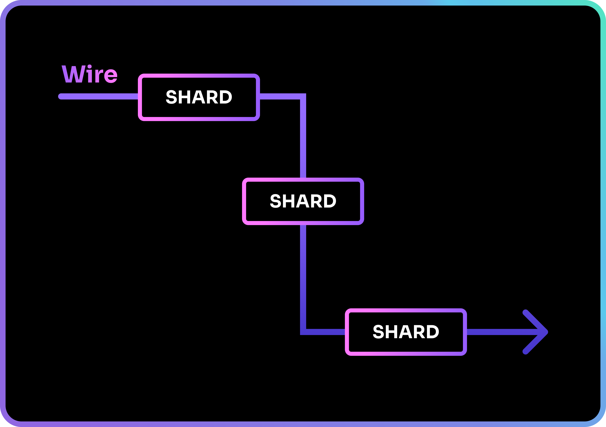
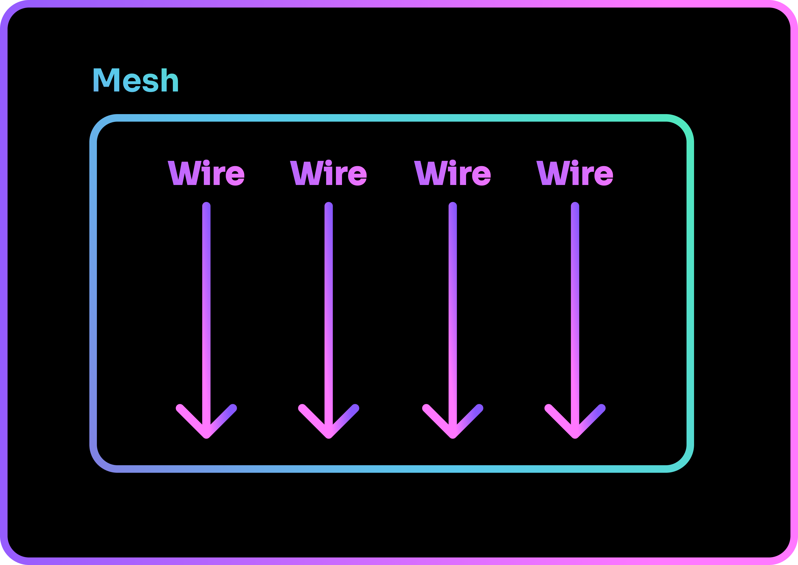
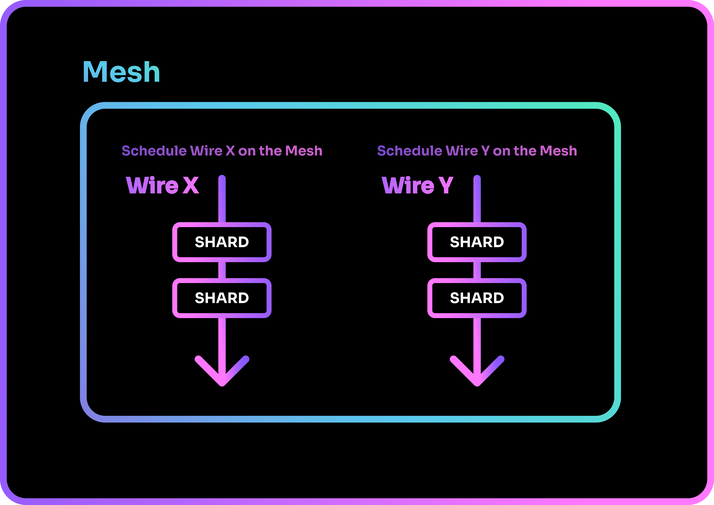
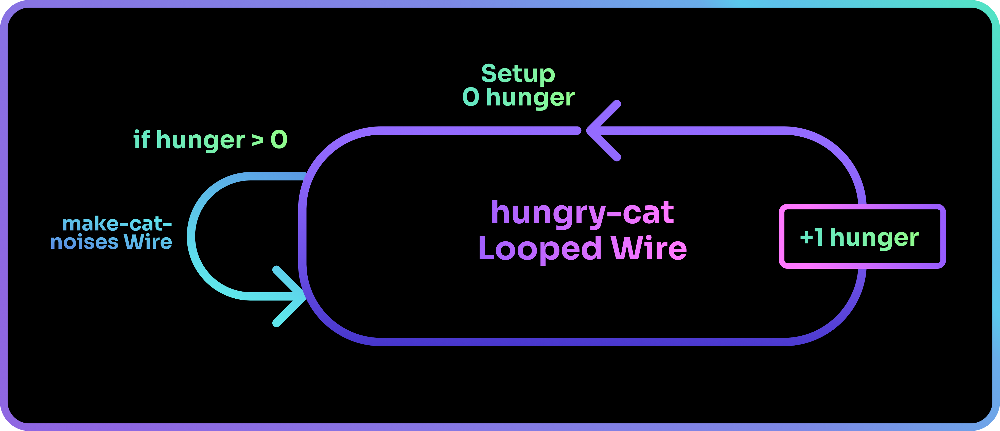

# Coding with Shards

In this chapter, we will be learning how to code with Shards so that you can write your very own program!

## The shard

A shard in its most basic code form consists of its name surrounded by parentheses.


The above example consists of 3 different predefined shards.

Shards are named to make their purpose rather intuitive. [`(Msg)`](../../../reference/shards/General/Msg) is the Message shard that prints a message to the console, while [`Math.Add`](../../../reference/shards/Math/Add/) is a Mathematics shard that add numbers together.

!!! note
    It is a good practice to name your code based on their purpose. This allows others to easily understand what your code achieves without getting too technical.

    For example, the code `(Msg "Hello World!")` can be easily understood to be sending the message "Hello World" to the console. You do not need to delve into how `(Msg)` was coded to understand what it can do.


A shard can take in an input, process that input, and produce an output. Shards also have *parameters* which behave as user-defined settings.

For example, `Math.Add` has the parameter `Operand` which is defined by the user. It determines the value that will be added to the input. The final result is then produced as the output.


In code form, parameters are defined by the user within the parentheses of the shard itself, after the shard's name. The above examples will appear as `5 (Math.Add 1)` and `5 (Math.Add 3)` in code. 
 
Some shards have multiple parameters. When specifying values for multiple parameters, you will have to prepend your values with the parameter they are for if some parameters are skipped.

Let us take a look at the `Repeat` shard which has four parameters: `Action`, `Times`, `Forever`, `Until`.

We can utilize the `Repeat` shard with its different parameters as shown:

=== "1 Parameter (Implied)"

    ```{.clojure .annotate linenums="1"}
    (Repeat
        (-> (Msg "Hello World!"))) ;; (1)(2)
    ```

    1. When no parameters are specified, parameters are treated as *implied* and are resolved in order. In this case, `Action` is the implied parameter for `Repeat` and we set `(Msg "Hello World")` to it.
    2. Since the other parameters are not defined, they will assume their default values. In this case, the `Repeat` shard will not run at all as `Times` has a default value of 0.

=== "2 Parameters (Fully Declared)"
    
    ```{.clojure .annotate linenums="1"}
    (Repeat 
        :Action (-> (Msg "Hello World!")) ;; (1)
        :Times 2) ;; (2)
    ```

    1. The parameters are fully declared for clarity.
    2. Repeats the `Action` twice.

=== "2 Parameters (Implied)"
    
    ```{.clojure .annotate linenums="1"}
    (Repeat 
        (-> (Msg "Hello World!")) 2) ;; (1)
    ```

    1. Both parameters can be implied since they are resolved in order. In this case, `Action` is the first implied parameter, and `Times` is the second implied parameter.

=== "2 Parameters (Implied 1st)"
    
    ```{.clojure .annotate linenums="1"}
    (Repeat 
        (-> (Msg "Hello World!")) ;; (1)
        :Times 2)
    ```

    1. You can still implicitly declare the first parameter, while fully declaring the other parameters. Note that it does not work vice versa. You cannot implicitly declare parameters if the parameter before it has been fully declared.

=== "(INCORRECT) 2 Parameters (Implied 2nd)"
    
    ```{.clojure .annotate linenums="1"}
    (Repeat 
        :Action (-> (Msg "Hello World!")) 
        2) ;; (1)
    ```

    1. This will not work as you cannot implicitly declare the second parameter if the first has been fully declared.

=== "3 Parameters (Fully Declared)"
    
    ```{.clojure .annotate linenums="1"}
    (Repeat
       :Action (-> (Msg "Hello World!"))
       :Forever true ;; (1)
       :Until ( ;; some condition
       )) ;; (2)
    ```

    1. The `Times` parameter is skipped and `Forever` is declared instead. Since we are skipping a parameter, we must fully declare the parameters that come after it.
    2. `Until` takes a shard that returns `true` or `false`. `Repeat` will loop forever until the shard specified in `Until` evaluates to `true`.

!!! note "`->`"
    When using shards for a parameter (e.g., `Action`), you must always place `->` before the first shard.

    [`->`](../../../reference/functions/misc/) is a shard container used to group multiple shards together. We will see how to eliminate the use of `->` later in the segment for `defshards`.

To find out more about the input/output/parameter of a shard, you can search for the shard in the search bar above and check out its documentation page.

!!! note "Give it a try!"
    Type "Msg" in the search bar above and select the first result that appears. It should lead you to the page for `Msg` [here](../../../reference/shards/General/Msg/).

    From there, you can learn more about:

    * The purpose of the shard

    * Its parameters

    * The input type it can receive

    * The output it will produce

    * How to utilize the shard by looking at the examples given

## Data Types

A shard can take in data, process it, and output the results.


There are many different types of data in the Shards language, and each shard will have specific data types that it can work with. 

For example, the [`Math.Add`](../../../reference/shards/Math/Add/) shard can only work with numeric data types, while the [`Log`](../../../reference/shards/General/Log/) shard that prints information to the console can work with `Any` data type.

Here are some of the data types found in Shards:

| Data Type   | Description                                            | Example           |
| :---------- | :----------------------------------------------------- | :---------------- |
| `Any`       | Any data type.                                         |                   |
| `None`      | No data type.                                          |                   |
| `Bool`      | Evaluates to either `true` or `false`.                 | `true`, `false`   |
| `Float`     | A numerical value with a decimal point.                | `2.53`, `-9.124`  |
| `Int`       | A numerical value with no decimals. Read as "integer". | `2`, `-9`         |
| `Sequence`  | A collection of values.                                | `[2.5, -9.1, 9.7]`|
| `String`    | Characters enclosed by double quotes.                  | "A string!"       |
| `Wire`      | A sequence of shards.                                  |                   |

!!! note
    A shard can have multiple data types as its input and output. For example, the shard `Math.Add` can have its input and output as an `Int`, or it can have its input and output as a `Float`.

For the full list of data types and more in-depth reading, check out the `Types` documentation page [here](../../../reference/shards/types/).


## Variables

To better work with data across your code, we can assign them to data containers known as *variables*.

Imagine a scenario where you have a float `3.141592653589793` that you need to reuse in code multiple times. Instead of typing the entire float out each time, you could assign it to a variable called `.pi-value` and simply use that variable whenever its needed.

=== "Without Variables"

    ```{.clojure .annotate linenums="1"}
    3.141592653589793 (Math.Add 3.141592653589793) (Math.Multiply 3.141592653589793) (Math.Subtract 3.141592653589793)
    ```
=== "With Variables"

    ```{.clojure .annotate linenums="1"}
    3.141592653589793 = .pi-value ;; (1)
    .pi-value (Math.Add .pi-value) (Math.Multiply .pi-value) (Math.Subtract .pi-value)
    ```

    1. 3.141592653589793 is assigned to the variable `.pi-value`. We'll learn more about assigning variables in a bit!
  
Variable names always start with a `.` period.

Some example of variable names:

- `.x`

- `.number-of-apples`

- `.is-verified` 

How you assign data to variables depends on the variable type. The main differences between variables are as follows:

- Constant vs Mutable

    - Constant: The variable's value cannot be changed once defined.

    - Mutable: The variable's value can be changed.

- Local vs Global

    - Local: The variable is only known within the Wire it originated from.

    - Global: The variable is known throughout the entire Mesh.

!!! note "Local vs Global"
    We will learn more about this later in the section about [Scope](../working-with-data/#scope) in Shards.

Here are the variable types and the symbols used to create and assign to them:

| Variable Type   | Shard       | Alias  | Description                          |
| :-------------- | :---------- | :----- | :----------------------------------- |
| Local, Constant | `Ref`       | `=`    | Creates a local constant variable.   | 
| Local, Mutable  | `Set`       | `>=`   | Creates a local mutable variable.    |
| Global, Mutable | `Set`       | `>==`  | Creates a global mutable variable.   |
| Mutable         | `Update`    | `>`    | Updates a mutable variable.          |

In summary:

- Use `=` to create **constant** variables.

- Otherwise, use `>=` to create **local** variables, or `>==` to make them **global**.

- Use `>` to update variable values.

!!! note "Alias"
    Some shards have an alias to reduce your code's verbosity. They can represent shards with defined settings, as you will see in `Setup` below.

When defining variables in your program, you can use `Setup` to ensure that variables defined within it will only ever be defined once within a program.

=== "Defining Variables in Setup"

    ```{.clojure .annotate linenums="1"}
    (Setup
     10 >= .timer
     100 >= max-points) ;; (1)
    ```

    1. Code within a `Setup` will only be run once. As such, you can prevent variables defined in a loop from being reset each time.

`Setup` is an alias of the shard [`Once`](../../../reference/shards/General/Once/), with its `Every` parameter set to 1 to ensure that code defined in it's `Action` parameter will only be run once.

## Grouping shards

[`defshards`](../../../reference/functions/macros/#defshards) allows you to group multiple shards together to form a new shard, thereby eliminating the use of `->`. It is useful for organizing your code and improving readability.

`defshards` has a syntax as such:

=== "Code"
    
    ```{.clojure .annotate linenums="1"}

    (defshards shard-name []
        ;; your shards here
    )
    ```

The square brackets `[]` is where you can define parameters. For example:

=== "Code"
    
    ```{.clojure .annotate linenums="1"}

    (defshards send-message [message]
        (Msg "Message Incoming...")
        (Msg message))
    ```

When used in code:

=== "Code"
    
    ```{.clojure .annotate linenums="1"}

    (send-message "Hello World!")
    ```

=== "Result"
    
    ```{.clojure .annotate linenums="1"}

    Message Incoming...
    Hello World!
    ```

Let us now take a look at how we can utilize `defshards` in a code snippet that counts from 1 to 5 multiple times.

=== "Code"
    
    ```{.clojure .annotate linenums="1"}

    (Repeat
     :Action
     (-> (Msg "1")
         (Msg "2")
         (Msg "3")
         (Msg "4")
         (Msg "5"))
     :Times 5)
    ```

We can eliminate the use of `->` and make the code more readable by defining a new shard named `msg-one-to-five`.

=== "Code"
    
    ```{.clojure .annotate linenums="1"}
    
    (defshards msg-one-to-five []
      (Msg "1")
      (Msg "2")
      (Msg "3")
      (Msg "4")
      (Msg "5"))
    ```

`defshards` inherently behaves as a shards container, thereby removing the need to use `->` for parameters that takes in shards.

=== "Code"
    
    ```{.clojure .annotate linenums="1"}
  
    (Repeat
     :Action (msg-one-to-five)
     :Times 5)
    ```
!!! note
    The parameter will still require a `->` if it contains multiple shards.

    === "Code"
    
        ```{.clojure .annotate linenums="1"}
  
        (Repeat
         :Action
         (-> (msg-one-to-five)
             (Msg "6"))
         :Times 5)
        ```

## The Wire

A Wire is made up of a sequence of shards, queued for execution from left to right, top to bottom.



To create a Wire, we use [`defwire`](../../../reference/functions/macros/#defwire).

=== "Creating a Wire"
    
    ```{.clojure .annotate linenums="1"}
    (defwire wire-name 
      ;; shards here
    )
    ```

!!! note
    The syntax for `defwire` is different from `defshards` as you cannot define parameters. Square brackets `[]` are not used.

!!! note
    Unlike `defshards` which groups shards up for organization, `defwire` groups shards up to fulfill a purpose. As Wires are created with a purpose in mind, they should be appropriately named to reflect it.

A Wire's lifetime ends once the final shard within it has been executed. To keep a Wire alive even after it has reached its end, we can set it to be loopable. This is called a Looped Wire.


A Looped Wire will continue running until its exit conditions have been met.

!!! note
    You will learn more about the entering and exiting of Looped Wires in the next chapter!

To create a Looped Wire, we use [`defloop`](../../../reference/functions/macros/#defloop).

=== "Creating a Looped Wire"
    
    ```{.clojure .annotate linenums="1"}
    (defloop loop-name 
      ;; shards here
    )
    ```

## The Mesh

Wires are queued for execution within a Mesh, from left to right, top to bottom.



To queue a Wire on a Mesh, we use [`schedule`](../../../reference/functions/misc/#schedule).

=== "Scheduling a Wire"
    
    ```{.clojure .annotate linenums="1"}
    (schedule mesh-name wire-name)
    ```

!!! note
    We will learn more about controlling the flow of Shards with Wires and Meshes in the following chapter.


## Running Shards

In order to actually get Shards running, a specific hierarchy and sequence must be followed. Your shards are first queued into Wires, which are then queued onto a Mesh.



When the Mesh is run, the Wires are executed in sequence and your program is started. This is done using the aptly named command [`run`](../../../reference/functions/misc/#run).

=== "Running a Mesh"
    
    ```{.clojure .annotate linenums="1"}
    (run mesh-name)
    ```

`run` can take in two optional values:

- The interval between each iteration of the Mesh.

- The maximum number of iterations, typically used for Debugging purposes.

!!! note
    If your program has animations, we recommend that you set the first value to `(/ 1.0 60.0)` which emulates 60 frames per second (60 FPS).

    === "Running a Mesh at 60 FPS"
    
        ```{.clojure .annotate linenums="1"}
        (run mesh-name (/ 1.0 60.0))
        ```

Let us now take a look at how a basic Shards program will look like!

## Writing a sample program

Do you recall the `hungry-cat` loop from the previous chapter? Let us try to implement a simpler modified version of it using the concepts learned in this chapter.



In this example, the "cat" starts off with 0 hunger. At the end of each loop, we increase the hunger by 1. Once the value of hunger is greater than 0, the cat starts to make cat noises.

### defshards and defwire

Let us first define the `make-cat-noises` Wire.

=== "make-cat-noises"
    
    ```{.clojure .annotate linenums="1"}
    (defwire make-cat-noises
      (Msg "Meow") (Msg "Meow") (Msg "Meow")
      (Msg "Mew") (Msg "Mew") (Msg "Mew")
      (Msg "Meow") (Msg "Meow") (Msg "Meow")
      (Msg "Mew") (Msg "Mew") (Msg "Mew"))
    ```

We can employ the `Repeat` shard we saw earlier to make our code more efficient. 

=== "make-cat-noises"
    
    ```{.clojure .annotate linenums="1"}
    (defwire make-cat-noises
      (Repeat
       :Action (-> (Msg "Meow"))
       :Times 3)
      (Repeat
       :Action (-> (Msg "Mew"))
       :Times 3)
      (Repeat
       :Action (-> (Msg "Meow"))
       :Times 3)
      (Repeat
       :Action (-> (Msg "Mew"))
       :Times 3))
    ```
Going a step further, we can better organize our code by creating new shards with `defshards`. Look at how much neater it is now!

=== "make-cat-noises"
    
    ```{.clojure .annotate linenums="1"}
    (defshards meows []
      (Repeat
       :Action (-> (Msg "Meow"))
       :Times 3))

    (defshards mews []
      (Repeat
       :Action (-> (Msg "Mew"))
       :Times 3))

    (defwire make-cat-noises
      (meows) (mews) (meows) (mews))
    ```
### The Loop

With the `make-cat-noises` Wire done, let us now look at creating the full `hungry-cat` program loop.

=== "hungry-cat"
    
    ```{.clojure .annotate linenums="1"}
    (defloop hungry-cat)
    ```

We want to first create a variable to track the cat's hunger level. Create the `.hunger` variable and assign the value of 0 to it. Remember to create it within a `Setup` to prevent the variable from being reassigned every loop.

=== "hungry-cat"
    
    ```{.clojure .annotate linenums="1"}
    (defloop hungry-cat
      (Setup
       0 >= .hunger)) ;; (1)
    ```

    1. Code within a `Setup` will only be run once in a program.

Next, use the [`Math.Inc`](../../../reference/shards/Math/Inc/) shard to increase the value of `.hunger` every time the Wire loops.

=== "hungry-cat"
    
    ```{.clojure .annotate linenums="1"}
    (defloop hungry-cat
      (Setup
       0 >= .hunger)
      (Math.Inc .hunger))
    ```

### Conditionals

A conditional can be used to check if `.hunger` is greater than 0. When the cat's hunger level has risen above 0, we want the cat to start making cat noises. Some conditional shards that you can use are:

- [`When`](../../../reference/shards/General/When/)
- [`If`](../../../reference/shards/General/If/)

`When` allows you to specify what happens if a condition is met. The syntax reads as: `When` a condition is met, `Then` a specified action happens.

`If` is similar to `When`, but it has an additional parameter `Else` that allows it to have a syntax that reads as: `If` a condition is met, `Then` a specified action occurs, `Else` another action is executed instead.

For this example, using `When` would suffice as we only need `make-cat-noises` to run `When` hunger `IsMore` than 0.

=== "hungry-cat"
    
    ```{.clojure .annotate linenums="1"}
    (defloop hungry-cat
      (Setup
       0 >= .hunger)
      (When
       :Predicate (IsMore 0) ;; (1)
       :Action (-> (Detach make-cat-noises))) ;; (2)
      (Math.Inc .hunger))
    ```

    1. [`IsMore`](../../../reference/shards/General/IsMore/) compares the input to its parameter and outputs `true` if the input has a greater value. In this case, it is comparing the value of `.hunger` to 0.
    2. [`Detach`](../../../reference/shards/General/Detach/) is used to schedule a Wire on the Mesh. You will learn more about using `Detach` in the following chapter!

### Debugging

What if you wanted to check the value of `.hunger` in each loop iteration? 
We can employ a shard that is useful when you wish to debug your code - the [`Log`](../../../reference/shards/Math/Log/) shard.

!!! note "Debugging"
    Debugging is the process of attempting to find the cause of an error or undesirable behavior in your program. When attempting to debug your code, functions or tools that allow you to check the value of variables at various points in your code can be useful in helping you narrow down where the errors could be originating from.

`Log` is useful as it can be placed at any point of your code to check the value passing through it. In this example, we will use `Log` to verify the value of `.hunger` before the conditional check with `When` occurs. Upon running the code, you will see that when the value of `.hunger` becomes 1, the cat starts to make noises.

### Readying the Mesh

Before our program can run, do not forget to:

- Define the Mesh.

- `schedule` the Wire on the Mesh.

- `run` the Mesh.

=== "hungry-cat"
    
    ```{.clojure .annotate linenums="1"}
    (defmesh main)

    (defshards meows []
      (Repeat
       :Action (-> (Msg "Meow"))
       :Times 3))

    (defshards mews []
      (Repeat
       :Action (-> (Msg "Mew"))
       :Times 3))

    (defwire make-cat-noises
      (meows) (mews) (meows) (mews))

    (defloop hungry-cat
      (Setup
       0 >= .hunger)
      .hunger (Log "Hunger Level")
      (When
       :Predicate (IsMore 0)
       :Action (-> (Detach make-cat-noises)))
      (Math.Inc .hunger))

    (schedule main hungry-cat)
    (run main 1 3) ;; (1)
    ```

    1. We set the Mesh to only run 3 iterations. This means that the `hungry-cat` loop will only occur 3 times.
    
=== "Results"
    
    ```
    [hungry-cat] Hunger Level: 0
    [hungry-cat] Hunger Level: 1
    [make-cat-noises] Meow
    [make-cat-noises] Meow
    [make-cat-noises] Meow
    [make-cat-noises] Mew
    [make-cat-noises] Mew
    [make-cat-noises] Mew
    [make-cat-noises] Meow
    [make-cat-noises] Meow
    [make-cat-noises] Meow
    [make-cat-noises] Mew
    [make-cat-noises] Mew
    [make-cat-noises] Mew
    [hungry-cat] Hunger Level: 2
    [make-cat-noises] Meow
    [make-cat-noises] Meow
    [make-cat-noises] Meow
    [make-cat-noises] Mew
    [make-cat-noises] Mew
    [make-cat-noises] Mew
    [make-cat-noises] Meow
    [make-cat-noises] Meow
    [make-cat-noises] Meow
    [make-cat-noises] Mew
    [make-cat-noises] Mew
    [make-cat-noises] Mew
    ```

Congratulations! You have now learned the fundamentals of writing a Shards program.

We will next look at how you can manipulate the flow of Shards to give you better control of how your program utilizes different Wires.

<!-- TODO Pop Quizzes 
## Pop Quiz
Here's a short quiz to test your understanding of this chapter. -->

--8<-- "includes/license.md"
