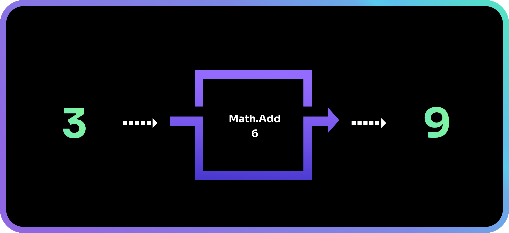
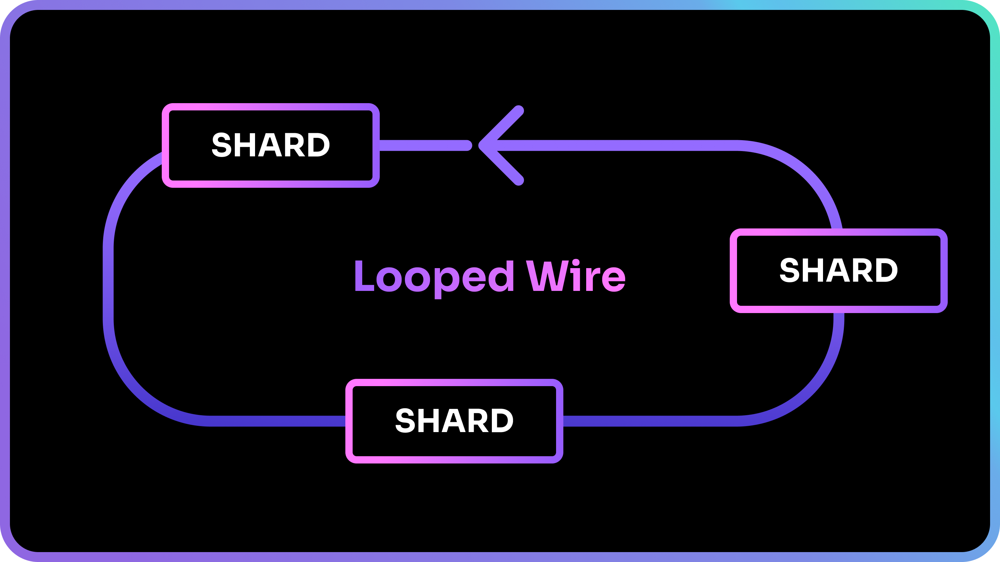
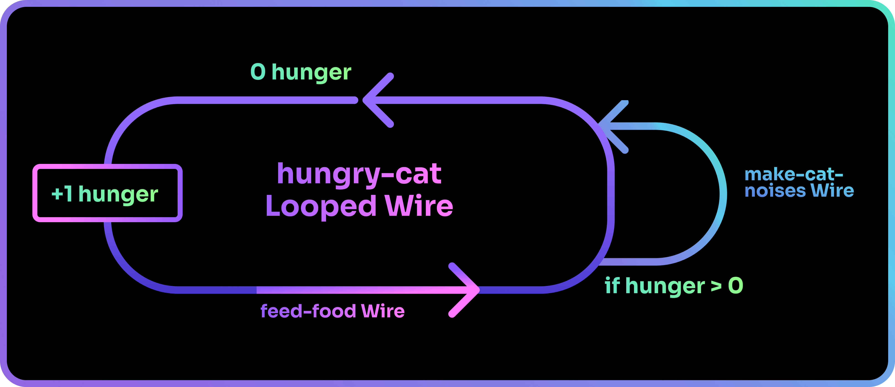

# What is Shards

Let us first learn about what makes up the language of Shards.

## The shard

The basic building block of the Shards programming language is called a shard (with a lowercase ‘s’).

A shard can receive an input, do work on that input, and produce an output.

Every shard has a role and is usually named after it. For example, the shard `Math.Add` takes a number as an input, adds a specified value to it and outputs the result.

Shards can be grouped up to form another shard. 

For example, you might have a `meow` shard that prints a "meow" to the user's screen. 

If you wanted to create a `meow-a-lot` shard, you could simply create a shard that contains a mixture of `meow` and `mew` shards.

## The Wire
In the flow of a Shards program, each shard is queued for execution and will be run in the order they are presented in. The order goes from left to right, top to bottom.

When shards are queued, they form a sequence know as a **Wire**.

Wires can be set to be loopable. This is called a **Looped Wire**.

You may look at this and wonder if the `meow-a-lot` shard from before is a Wire too, since it has shards queued within it.

The answer is... no! A Wire is not the same as a shard containing shards. 

Even though they might both behave like a *function* in traditional coding, they are not the same.

??? "What are functions?"
    It is a block of code that can be reused over and over again.
    
    It allows you to reuse code without writing out the same block of code each time by calling the function's name instead.

## To Wire or not?

An easy way to understand the difference is to think of Wires as being "alive". Their states are always maintained while your code is running, and they continue to exist even after they have completed their jobs. 

On the other hand, when you call a shard, they will only exist in that moment to complete their jobs. Once done, their state is lost and they cease to exist.

Let us look at a simple example of how Wires and shards can be used.

We have a `feed-food` Wire that has a `food` variable with a starting value of 10. 

??? "Variables"
    Variables are containers that store values. You define a variable with a name, and assign a value to it. The value can then be retrieved by calling the variable with its assigned name.

Every time the Wire is called, it deducts 1 food from the total. Since the Wire maintains its state even after it has been executed, the `food` value is maintained, and the value continues to fall each time the Wire is called.

It also takes in a `hunger` variable as input, reduces it by 1 IF `food` is greater than 0, and returns it as an output.

Next up, we have the `hungry-cat` Looped Wire. 

`hungry-cat` starts with `hunger` at 0, which increases as the loop runs. 

It then executes `feed-food` which reduces `hunger` by 1 if the `food` variable within it is still more than 0. The loop continues running until the `feed-food` Wire runs out of `food`. The hungry cat will then start to `meow-a-lot` as it gets hungry.

Since `meow-a-lot` does not require a state to be tracked, it works as a shard whose only purpose is to meow... a lot.

Meanwhile, `feed-food` has to track the amount of `food` left, and thus works well as a Wire whose state persists after every run.

The `hungry-cat` also has to track its `hunger`, and is thus defined as a Wire. It is made loopable so that it can continue running even after the Wire has completed its execution.

## The Mesh

In order to actually run shards, we have to schedule Wires on a Mesh. Multiple Wires can be scheduled, and they will be run in the order that they are scheduled in.

After scheduling our Wires, we can finally run the Mesh... and that is when Shards comes to life!

!!! note
    If the scheduling of Wires seems rigid to you, fret not! We will be learning more about manipulating the flow of Shards later.

Now that you have a basic understanding of what Shards are, let us take a look at how coding with Shards work.

--8<-- "includes/license.md"
